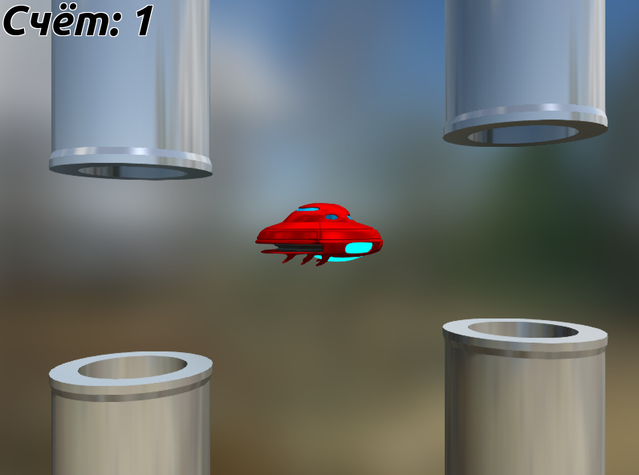

# Игры всерьез / Flappy Urho

В прошлых статьях
([Первые шаги](https://github.com/urho3d-learn/first-steps), [Редактор](https://github.com/urho3d-learn/editor))
мы создавали небольшие приложения на языке AngelScript. На этот раз я хочу продемонстрировать, что благодаря продуманной
структуре движка писать игры на таком страшном языке, как C++, так же легко, как и на скриптовом языке.
Но чтобы вам не было слишком скучно читать, вместо длиннющей статьи я подготовил небольшую игру (клон Flappy Bird),
исходный код которой очень подробно прокомментирован.



## Испольуземая версия движка

Хорошим решением будет хранение используемой версии движка вместе с игрой:
* в движке Urho3D в любой момент могут произойти изменения, ломающие обратную совместимость
* зачастую вам придётся модифицировать движок под конкретную игру

Таким образом вы осуществляете поддержку старой игры, используя старую версию движка,
а когда начинаете разработку новой игры - просто берёте последнюю версию движка.

Движок очень легковесный, так что наличие нескольких копий не является проблемой.

Для скачивания и компиляции движка зайдите в папку `engine` и последовательно запустите `1_download.bat`, `2_cmake_vs.bat` и `3_build_vs.bat`. При этом будет скомпилирована и отладочная, и релизная версия движка. Приложения `Minimal App`, `AngelScript Vs C++` и `Flappy Urho` будут использовать движок из этой папки.

## Минимальное приложение

Минимальное приложение находится в папке `minimal_app`. Для компиляции последовательно запустите `1_cmake_vs.bat` и `2_build_vs.bat`.

```
#include <Urho3D/Engine/Application.h>

// Чтобы везде не писать Urho3D::ИмяТипа
using namespace Urho3D;

// Главный класс игры
class Game : public Application
{
    // Макрос добавляет в класс информацию о текущем и базовом типе
    URHO3D_OBJECT(Game, Application);

public:
    // Конструктор класса
    Game(Context* context) : Application(context)
    {
    }
};

// Указываем движку главный класс игры
URHO3D_DEFINE_APPLICATION_MAIN(Game);
```

Обращаю ваше внимание на первую особенность: каждый класс, который является производным от класса `Urho3D::Object` (а в Urho3D таких большинство) должен содержать макрос `URHO3D_OBJECT(имяКласса, имяБазовогоКласса)`. Этот макрос сохраняет имя класса в виде строки и хэша. Хэш имени используется, например, в фабрике объектов, о которой чуть позже. Смотрите также: <https://urho3d-doxygen.github.io/1_9_0_plus/_object_types.html>.

## AngelScript versus C++

Сравните [переписанный на языке C++](angelscript_vs_cpp/root/src/main.cpp) пример с вращающимся кубом из
[первой статьи](https://github.com/urho3d-learn/first-steps) с
[оригиналом](https://github.com/urho3d-learn/first-steps/blob/main/result/Data/scripts/main.as).
Код почти идентичен. Разве что `.` заменены на `->`, а `@` на `*`. Более того, на C++ писать даже легче, так как имеется куча инструментария вроде IDE и отладчиков, да и нативный код быстрее скриптов. В общем, я рекомендую писать на C++ везде, где это возможно.

## Фабрика объектов

Особенность вторая: каждый компонент, который вы создаете, перед использованием необходимо зарегистрировать с помощью `Context::RegisterFactory<...>()`.

Зачем такое неудобство? Допустим, мы загружаем сцену из XML-файла. В этом файле у нас нет ничего, кроме набора строк:

```
<node id="2">
    ...
    <component type="StaticModel" id="3">
        ....
    </component>
</node>
```

Таким образом нам нужен механизм, который позволяет создавать объекты нужного типа (в данном случае `StaticModel`), имея лишь имя этого типа в виде строки. Таким механизмом и является фабрика объектов. Но прежде, чем фабрика будет способна порождать объекты нужного типа, этот тип нужно зарегистрировать в фабрике. Как пример регистрации компонента смотрите [EnvironmentLogic.cpp](flappy_urho/src/EnvironmentLogic.cpp).

## Смена сцен и состояния игры

Золотое правило: никогда не уничтожайте сцены и не меняйте состояние игры посередине игрового цикла.

Рассмотрим пример:

```
class Game : public Application
{
    void HandleUpdate(...)
    {
        Если была нажата клавиша ESC и состояние игры == игровой процесс,
            то состояние игры = главное меню
    }
}

class UILogic : public LogicComponent
{
    void Update(...)
    {
        Если была нажата клавиша ESC и состояние игры == главное меню,
            то состояние игры = игровой процесс
    }
}
```

Получается, что если игрок нажмет клавишу ESC, то это нажатие обработается дважды в разных местах программы и в итоге главное меню игрок так и не увидит. Ситуация, когда половина игрового цикла выполняется в одном состоянии игры, а другая в другом, может привести к серьезным логическим ошибкам и разрешить их будет крайне проблематично. А для более-менее большого проекта с множеством компонентов уследить за всеми логическими связями и разобраться с ошибками, когда куски кода срабатывают в разных игровых состояниях вообще нереально.

Решением этого будет не менять состояние игры мгновенно, а хранить требуемое состояние в дополнительной переменной и фактическую смену состояния производить в начале следующей итерации игрового цикла до обработки любых событий. В качестве примера смотрите файл [Global.h](flappy_urho/src/Global.h), в котором объявляются две переменные `gameState_` (текущее состояние игры) и `neededGameState_` (требуемое состояние игры) и файл [Game.cpp](flappy_urho/src/Game.cpp), в котором реализована смена состояния в обработчике `HandleBeginFrame` главного класса игры.

Другая ситуация: игрок нажал на кнопку и ему нужно перейти на следующий уровень. Если вы в обработчике одного из событий попытаетесь удалить из памяти текущую сцену и загрузить другую, то игра может вообще вылететь, когда движок, идя дальше циклу попытается обратиться к объектам, которые уже не существуют. Проблема решается аналогичным способом.

## Умные указатели

Одним из преимуществ скриптовых языков является автоматическое освобождение памяти для неиспользуемых объектов. Умные указатели добавляют это удобство и в язык C++. Не буду особо углубляться в эту тему, так как этой информации полно в интернете, просто сделаю несколько замечаний:

* Пока существует хотя бы один строгий указатель `Urho3D::SharedPtr`, указывающий на какой-то объект, этот объект будет существовать.
* Слабый указатель `Urho3D::WeakPtr` не удерживает объект от уничтожения, а значит помогает решать проблему цикличности ссылок. Он похож на обычный указатель, однако позволяет точно знать, был ли объект уничтожен.
* Urho3D использует интрузивный подсчет ссылок, то есть в отличие от std::shared_ptr счетчик находится в самом объекте. Это позволяет передавать в функции обычные указатели.
* Создавать умные указатели в глобальной области видимости — плохая идея. При выходе из игры вы можете получите крэш при обращении указателя к памяти, уже освобожденной при разрушении контекста. Лучше храните их в собственной подсистеме (об этом ниже).

Кстати, в игре `Flappy Urho` я вообще не использовал умные указатели, так как все необходимые объекты создаются в начале игры и существуют на протяжении всей работы программы.

Смотрите также <https://urho3d-doxygen.github.io/1_9_0_plus/_conventions.html>.

## Собственные подсистемы

Для доступа к глобальным переменным и функциям бывает очень удобно создать собственную подсистему. Подсистема — это обычный объект Urho3D, который существует в единственном экземпляре. После регистрации подсистемы с помощью функции `Context::RegisterSubsystem()` вы можете получить в ней доступ из любого объекта как к любой другой подсистеме с помощью метода GetSubsystem<...>(). Данный подход используется в игре `Flappy Urho` (подсистема Global).

Смотрите также <https://urho3d-doxygen.github.io/1_9_0_plus/_subsystems.html>.

## Атрибуты

Атрибуты позволяют автоматизировать сериализацию/десериализацию объектов, которая выполняется при их загрузке и сохранении на диск, а также при сетевой репликации. Подробнее смотрите в <https://urho3d-doxygen.github.io/1_9_0_plus/_serialization.html>.

## Заметки по игре

В модели летающей тарелки 32 тысячи полигонов. По-хорошему нужно было создавать low-poly модель и запекать нормали. Но так как в сцене мало объектов, то я решил на это не заморачиваться.

Управление:
* Левая кнопка мыши - прыгать
* Колесо мыши - отодвинуть/приблизить камеру (в целях отладки)
* Правая кнопка мыши - вернуть камеру на место
* Пробел - показать/спрятать отладочную геометрию

---

*Старые версии приложений: <https://github.com/1vanK/FlappyUrho>, <https://github.com/1vanK/Urho3DHabrahabr04>.*
